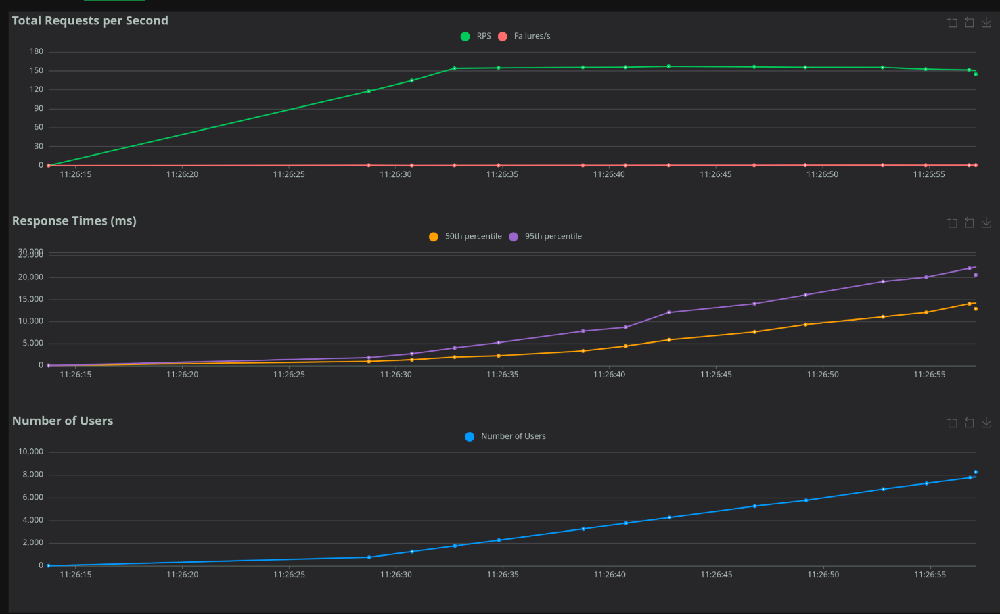

# Stats Service

## Работа с проектом

### 1 .Клонируйте репозиторий

```bash
git clone https://github.com/qnderkk/StatsService.git
cd stats_service
```

### 2. Переменные окружения

Создайте в корневой директории .env файл со своими данным, как показано на примере, за основу можно взять ".env.example".

```env
DB_HOST=db
DB_PORT=5432
DB_USER=postgres
DB_PASS=postgres
DB_NAME=stats

REDIS_HOST=redis
REDIS_PORT=6379
REDIS_PASS=redis
REDIS_DB=0
```

### 3. Сборка и запуск контейнеров

Склонируйте репозиторий и выполните команду в корневой папке проекта (там, где находится `docker-compose.yaml`):
(параметр --build не обязателен в последующих запусках)

```bash
docker-compose up --build -d
```

Если запуск происходит в первый раз надо выполнить миграцию в docker контейнер, чтобы подтянуть таблицы

```bash
docker-compose exec api alembic upgrade head
```

### 4. Документация

Swagger UI: http://localhost:8000/docs

Locust: http://localhost:8089

### 5. Эндпоинты

— Создание нового пользователя.

```bash
POST /api/v1/users/register
```

— Регистрация нового устройства с привязкой к user_id.

```bash
POST /api/v1/devices/register
```

— Прием телеметрии (Body: x, y, z).

```bash
POST /api/v1/stats/{device_id}
```

— Постановка задачи в очередь Celery.

```bash
POST /api/v1/analytics/users/{user_id}
```

— Получение результатов вычислений по идентификатору задачи.

```bash
GET /api/v1/analytics/tasks/{task_id}
```

### 6. Тестирование


